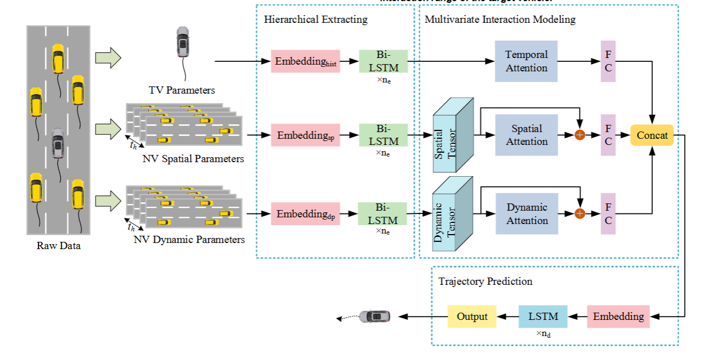

# Vehicle Trajectory Prediction using Aerial Images and Object Detection


## Overview

This project presents a unified pipeline for multivariate vehicle trajectory prediction and conflict zone detection using aerial drone footage. Leveraging deep learning models, attention mechanisms, and physics-based filtering, the system predicts future vehicle positions and estimates road safety using Post-Encroachment Time (PET) metrics.

Developed as part of the CEN-300 practical coursework, the work integrates multiple components such as custom object detection, spatiotemporal trajectory modeling, and conflict risk analytics.

**Repository:** [https://github.com/AGAMPANDEYY/vehicle_trajectory_prediction](https://github.com/AGAMPANDEYY/vehicle_trajectory_prediction)

---

## Problem Statement

Given a 5-minute aerial video captured by a UAV, the objective is to:

- Detect and track all vehicles (including two-wheelers).
- Predict future trajectories using motion context and neighboring vehicle interactions.
- Estimate potential conflict zones based on predicted paths and PET metrics.

---

## Project Workflow

1. **Data Collection and Annotation**  
   - Aerial footage from drones at ~30m altitude.
   - Manual annotation of 250+ images with three classes: Car, Bike, Bus.
   - Augmentation techniques applied: noise, brightness, cropping, rotation.

2. **Vehicle Detection & Tracking**  
   - **Model:** YOLOv8s for object detection, ByteTrack for multi-object tracking.  
   - **Libraries:** Roboflow Supervision, OpenCV, NumPy.  
   - Output: Vehicle bounding boxes and trajectories (frame-wise tracking).

3. **Trajectory Prediction Models**  
   - **Baseline:** Kalman Filter for trajectory smoothing and velocity estimation.  
   - **Deep Learning Model:**  
     - LSTM-based motion model.  
     - SDT-ATT (Spatial–Dynamic Attention with Bi-LSTM) for context-aware prediction.  
     - Incorporates 3 neighboring vehicles, bi-directional memory, and attention.

4. **Conflict Zone Detection**  
   - Conflict zones identified using Post-Encroachment Time (PET):  
     - PET = entry time of following vehicle – exit time of leading vehicle.  
     - Risk levels categorized from **SAFE** to **HIGH RISK** based on PET thresholds.  
   - Total of 141 conflict zones analyzed and mapped.

---

## Technical Summary

### Libraries & Tools

- **Computer Vision:** YOLOv8s, Roboflow, OpenCV
- **Tracking:** ByteTrack
- **Data Handling:** Pandas, NumPy
- **Modeling:** PyTorch, TensorFlow
- **Visualization:** Matplotlib, Seaborn

### Architecture

- **Detection:** YOLOv8s + ByteTrack
- **Trajectory Prediction:**  
  - Kalman Filter  
  - LSTM  
  - SDT-ATT with attention mechanism and Bi-LSTM layers
- **Conflict Zone Analysis:**  
  - PET computation  
  - Heatmap and statistical distribution analysis


---

## Evaluation Metrics

- **ADE (Average Displacement Error)**  
- **FDE (Final Displacement Error)**  
- **PET Risk Categorization:**
  - PET ≤ 0: Near Miss
  - 0 < PET ≤ 1.5s: High Risk
  - 1.5 < PET ≤ 3s: Moderate Risk
  - 3 < PET ≤ 5s: Low Risk
  - PET > 5s: Safe

---

## Results

- SDT-ATT outperforms traditional LSTM and Kalman approaches in multivariate prediction tasks.
- ~25–30% of observed vehicle interactions occurred in risk-prone PET windows.
- PET ≤ 5s recorded in ~40–45% of cases.
- Risk category heatmaps generated for conflict zone intensity visualization.

---

## Limitations

- SDT-ATT assumes perfect visibility of neighboring vehicles; occlusions affect accuracy.
- PET analysis relies purely on positional data without considering lane semantics.
- Lane-change behaviors are inferred, not explicitly modeled.
- Model performance is sensitive to tracking accuracy and annotation quality.

---

## Future Work

- Incorporate semantic maps including road boundaries and lane markings.
- Introduce explicit lane-change classification using multi-task learning.
- Deploy on live UAV feeds for real-time conflict detection.
- Extend prediction to 3D space (elevation-aware models).
- Enhance robustness using sensor fusion (e.g., LiDAR) and Transformer-based models.

---

## Authors

- Agam Pandey (22113009)  
- Hardik Chawla (22113056)  
- Krish Sharma (22124021)  
- Samarth Pratap Singh (22113129)

---

## References

- [Vehicle Trajectory Prediction Based on Multivariate Interaction Modeling (SDT-ATT)](https://ieeexplore.ieee.org/document/10323306/)
- [YOLOv8](https://github.com/ultralytics/ultralytics)
- [ByteTrack](https://github.com/ifzhang/ByteTrack)


ByteTrack: https://github.com/ifzhang/ByteTrack
---

# Quantifying near-miss interactions at conflict zones using Post-Encroachment Time (PET)


# SDTATT +Lane Change + Conflict Zone Identification mapped on Video


1. Trained yolov8 (already pretrained on drone video) on our video dataset with 200 annotated images, annotated on [Roboflow](https://app.roboflow.com/krish-sharma-koive/cen-300-object-detection/models) (Each image has more than 12 vehicles so took long time).[Final Model](https://drive.google.com/file/d/1bQXITQd8x8w_fs8d6smq-UQoAaCWxfcx/view?usp=sharing)
3. Build codes of SDTATT model from this paper https://ieeexplore.ieee.org/document/10323306/the used Target vehicle, 5 neighboring vehicles and 20 past frames history x,y. Used BiLSTM and Spatial Temporal Attention layers to predict contextual target vehicle future maneuver.
4. Now, once we have for each frame_id and vehicle_id  the future predicted trajectory, we perform lane change detection and conflict zone predictions. The lane change and conflict zone codes are also our own. 
5. We have to perform inference now to test the pipeline and once we run it, we will have final data of { timestamp, conflict_x, conflict_y, list_of_vehicles_involved} and we'll plot the conflict zones on the video and we could then come to a conclusion of potential accident locations in the video 




# Vehicle Trajectory Prediction

## Introduction  
This repository contains a project focused on predicting vehicle trajectories using advanced machine learning techniques. The goal is to accurately forecast the future path of vehicles based on historical data, which can be crucial for autonomous driving systems, traffic management, and safety applications.

## Table of Contents  
- [Introduction](#introduction)  
- [Getting Started](#getting-started)  
- [Project Structure](#project-structure)  
- [Installation](#installation)  
- [Usage](#usage)  
- [Guiding Code Snippets](#guiding-code-snippets)  
- [Contributing](#contributing)  
- [License](#license)  

## Getting Started  
To begin working with this project, follow these steps:

### Clone the Repository  
Clone this repository to your local machine using Git.

```bash
git clone https://github.com/AGAMPANDEYY/vehicle_trajectory_prediction.git
```

### Navigate to the Project Directory:

``` bash
cd vehicle_trajectory_prediction
```

### Project Structure

The project is organized as follows:  

- **`traffic-analysis-detection-tracking/data/`** – Contains datasets used for training and testing.  
- **`traffic-analysis-detection-tracking/trajectory_prediction_models`** – Includes the machine learning models implemented for trajectory prediction.  
- **`traffic-analysis-detection-tracking/main.py/`** – The entry point for running the prediction pipeline.  

Installation
To install the required dependencies, run:

```bash
pip install -r requirements.txt
```
Ensure you have Python and pip installed on your system.

### Usage
Running the Prediction Model
Prepare Data: Ensure your dataset is in the data directory.

Train the Model: Run the training script.

``` bash
python main.py --mode train
```

Make Predictions: Use the trained model to predict trajectories.

```bash
python main.py --mode predict
```

### Example Use Case
For a more detailed example, consider the following Python snippet:

``` python
import numpy as np
from models import TrajectoryPredictor

# Load data
data = np.load('data/vehicle_trajectories.npy')

# Initialize the predictor
predictor = TrajectoryPredictor()

# Train the model
predictor.train(data)

# Make predictions
predictions = predictor.predict(data)
``` 
### Guiding Code Snippets
Data Preprocessing
``` python
import pandas as pd

# Load data
df = pd.read_csv('data/raw_data.csv')

# Clean and preprocess data
df = df.dropna()  # Remove missing values
df = df[['x', 'y', 'speed']]  # Select relevant columns

# Save preprocessed data
df.to_csv('data/preprocessed_data.csv', index=False)
Model Training
python
from sklearn.model_selection import train_test_split
from models import TrajectoryPredictor

# Split data into training and testing sets
train_data, test_data = train_test_split(data, test_size=0.2, random_state=42)

# Initialize and train the model
predictor = TrajectoryPredictor()
predictor.train(train_data)

# Evaluate the model
accuracy = predictor.evaluate(test_data)
print(f"Model Accuracy: {accuracy}")
```

### Contributing

We welcome contributions from the community! To contribute, please follow these steps:

#### Steps to Contribute  

1. **Fork the Repository**  
   Click the **Fork** button on the top right of this repository to create your own copy.  

2. **Clone Your Fork**  
   Clone your forked repository to your local machine:  
   ```bash
   git clone https://github.com/your-username/repository-name.git
   cd repository-name
   ```
3. **Create a New Branch**
   Create a branch for your feature or fix:
   
   ``` bash
   git checkout -b feature-branch-name
   ```
4. **Commit, Push and open a PR!**

### License
> [!NOTE]
> This project is licensed under the MIT License. See LICENSE for details.

Feel free to adjust this template based on specific details from your repository. Ensure that you include accurate information about the project structure, dependencies, and usage guidelines.
