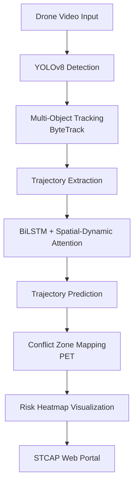

## Spatio-Temporal Vehicle Trajectory Prediction and Conflict Detection

**An Open Source Project for Real-Time Traffic Safety Analysis Using Attention-based BiLSTM**

---

### Overview

This repository presents an open-source, end-to-end framework for **vehicle trajectory prediction** and **conflict zone detection** from aerial drone footage. The system leverages state-of-the-art deep learning (BiLSTM with spatial-dynamic attention), robust object detection (YOLOv8), and surrogate safety metrics (Post-Encroachment Time, PET) to enable real-time, actionable traffic safety analytics. The project is designed for research, urban planning, and the development of intelligent transportation systems, with a focus on complex, unstructured traffic environments such as those common in Indian cities[2].

---

## Table of Contents

- [Introduction](#introduction)
- [Features](#features)
- [Methodology](#methodology)
- [System Architecture](#system-architecture)
- [Getting Started](#getting-started)
- [Usage](#usage)
- [Evaluation](#evaluation)
- [Results](#results)
- [Novelty & Contributions](#novelty--contributions)
- [Limitations & Future Work](#limitations--future-work)
- [Acknowledgements](#acknowledgements)
- [License](#license)

---

## Introduction

Accurate vehicle trajectory forecasting and conflict zone mapping are critical for next-generation road safety and autonomous driving. Traditional ground-based sensors are limited by occlusions and coverage. This project utilizes **aerial drone video** to track all vehicles (including two-wheelers), predict their future trajectories using deep learning and physics-based models, and dynamically identify potential conflict zones where unsafe interactions may occur[2].

---

## Features

- **Real-Time Vehicle Detection and Tracking**  
  Utilizes YOLOv8 and multi-object tracking (ByteTrack/DeepSORT) for robust, high-speed detection from aerial video[2].

- **Advanced Trajectory Prediction**  
  Implements a BiLSTM network with spatial-dynamic attention (SDT-ATT) to model both temporal dynamics and neighbor interactions, improving accuracy in dense and heterogeneous traffic[2].

- **Conflict Zone Identification**  
  Computes Post-Encroachment Time (PET) between vehicles to detect near-miss and high-risk events, visualized as spatial heatmaps[2].

- **End-to-End Automated Pipeline**  
  From raw video input to risk-mapped outputs, suitable for integration into traffic management systems or research workflows[2].


---

## Methodology

**1. Data Acquisition & Annotation**
- 5-minute drone video at 30 fps, urban intersection, manually annotated for vehicles and 141 conflict zones using Roboflow and VIA Annotator[2].

**2. Preprocessing**
- Frame extraction, normalization, sliding window trajectory generation (past 20 frames), neighbor selection, and conflict event extraction based on zone masks[2].

**3. Model Architecture**
- **Detection:** YOLOv8 for vehicle detection.
- **Tracking:** ByteTrack/DeepSORT for multi-object tracking.
- **Prediction:**  
  - Baselines: Kalman Filter, LSTM  
  - Main: BiLSTM with spatial-dynamic attention (SDT-ATT), modeling up to 3 neighbors and 2 lanes[2].
- **Conflict Analysis:** PET computation for each vehicle pair and conflict zone, mapped to risk categories (Near-Miss, High/Moderate/Low Risk, Safe)[2].

**4. Real-Time Inference Pipeline**
- Rolling buffer for past trajectories, periodic prediction, PET update, and visualization overlays (trajectories + risk heatmaps)[2].

---

## System Architecture



---

## Getting Started

**Prerequisites**
- Python 3.8+
- PyTorch
- Ultralytics YOLOv8
- OpenCV, pandas, numpy, seaborn
- Roboflow (for annotation)
- (Optional) NVIDIA GPU for real-time inference

**Installation**
```bash
git clone https://github.com/yourusername/vehicle-trajectory-prediction.git
cd vehicle-trajectory-prediction
pip install -r requirements.txt
```

**Dataset Preparation**
- Annotate drone video frames for vehicle detection using Roboflow.
- Annotate conflict zones using VIA Annotator.
- Place data in the `data/` directory as per the provided structure.

---

## Usage

**1. Training**
- Train detection model (YOLOv8) on annotated frames.
- Train SDT-ATT trajectory prediction model using extracted trajectories and neighbor context.

**2. Inference**
- Run the pipeline on new drone videos:
  - `python run_pipeline.py --video path/to/video.mp4`
- Optionally, use the [STCAP Web Portal](#) for interactive analysis and visualization.

**3. Outputs**
- Predicted vehicle trajectories (CSV)
- Conflict zone risk heatmaps (images/video overlays)
- PET statistics and event logs

---

## Evaluation

- **Trajectory Metrics:**  
  - Average Displacement Error (ADE)
  - Final Displacement Error (FDE)
- **Conflict Detection Metrics:**  
  - Precision, Recall, F1-score for PET-based near-miss detection
- **Runtime Performance:**  
  - End-to-end latency: ~38ms/frame (~26 FPS on RTX 2080 Ti)[2]

---

## Results

| Model         | ADE (px) | FDE (px) |
|---------------|----------|----------|
| Kalman Filter | 39.00    | 77.44    |
| LSTM          | 27.28    | 18.76    |
| SDT-ATT (Ours)| 25.86    | 18.06    |

- SDT-ATT outperforms baselines, especially in dense and heterogeneous traffic.
- PET analysis: 25-30% of interactions in risk-prone windows (PET < 5s); 40-45% of cases with PET < 5s[2].
- Real-time risk heatmaps accurately localize high-risk zones.

---

## Novelty & Contributions

- **Context-Aware Trajectory Prediction:**  
  SDT-ATT models both spatial and behavioral context, using neighbor and lane-based dynamics for improved accuracy in complex traffic[2].

- **Real-Time Risk Mapping:**  
  Dynamic PET-based heatmaps provide actionable, spatially localized safety insights, unlike prior work limited to numerical risk scores[2].

- **Unified Automated Pipeline:**  
  Fully automated from detection to risk mapping, enabling scalable deployment and reproducible research[2].

---

## Limitations & Future Work

**Current Limitations**
- Performance depends on annotation and tracking quality.
- Assumes ideal visibility of all vehicles (occlusions may reduce accuracy).
- Lane-change detection is implicit; no explicit classification module.
- Conflict detection does not use scene semantics (e.g., road boundaries)[2].

**Future Directions**
- Integrate explicit lane and road context for better prediction.
- Add supervised lane-change classification.
- Simulate more complex traffic scenarios and test on diverse datasets.
- Explore transformer-based and graph neural models for richer interaction modeling.
- Optimize for embedded/edge deployment and ultra-low latency[2].

---

## Acknowledgements

This project was developed by Agam Pandey, Hardik Chawla, Krish Sharma, and Samarth Pratap Singh under the supervision of Prof. Sanhita Das, Department of Civil Engineering, IIT Roorkee. Special thanks to open-source contributors and the research community whose tools and datasets made this work possible[2].

---

## License

This project is licensed under the MIT License. See [LICENSE](LICENSE) for details.

---

**For contributions, issues, or feature requests, please open an issue or submit a pull request.**  
**We welcome collaboration and encourage reproducible research!**

---

*This README is based on the academic project "Spatio-Temporal Vehicle Trajectory Prediction and Conflict Detection Using Attention-based BiLSTM" (CEN-300, IIT Roorkee, Jan-May 2025)[2].*

Citations:
[1] https://ppl-ai-file-upload.s3.amazonaws.com/web/direct-files/attachments/48783971/64222266-b633-49f0-b06f-77163dfb0435/CEN300.pdf
[2] https://ppl-ai-file-upload.s3.amazonaws.com/web/direct-files/attachments/48783971/af4dc2c9-35ac-4773-911b-adc1979db25d/CEN300_Report.pdf
[3] https://ppl-ai-file-upload.s3.amazonaws.com/web/direct-files/attachments/48783971/64222266-b633-49f0-b06f-77163dfb0435/CEN300.pdf
[4] https://ppl-ai-file-upload.s3.amazonaws.com/web/direct-files/attachments/48783971/af4dc2c9-35ac-4773-911b-adc1979db25d/CEN300_Report.pdf

---

